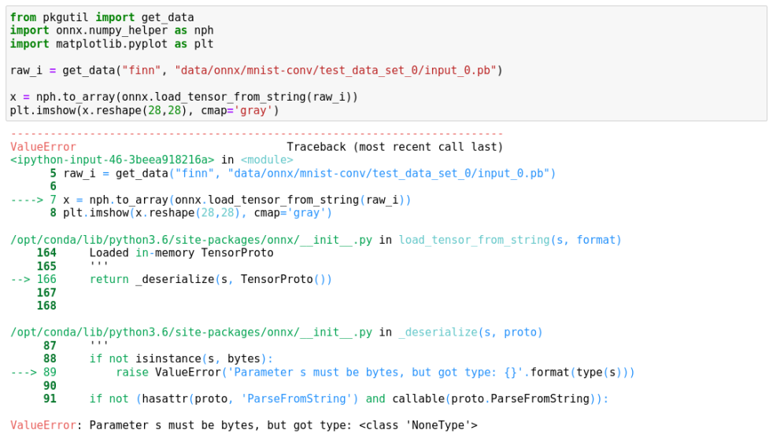

# Issues and Fixes

- Issue

Got permission denied while trying to connect to the Docker daemon socket

- Fix

Follow [this guide](https://www.digitalocean.com/community/questions/how-to-fix-docker-got-permission-denied-while-trying-to-connect-to-the-docker-daemon-socket). 

- Issue

You get the error ```start () got an unexpected keyword argument 'port'``` when trying to visualize using Netron. 

- Fix

 In ```finn/src/finn/util/visualization.py``` replace ```netron.start(model_filename, port=8081, host="0.0.0.0")``` with ```netron.start(model_filename, address=("0.0.0.0", 8081))```
 
 - Issue



- Fix

Replace 
```raw_i = get_data("finn", "data/onnx/mnist-conv/test_data_set_0/input_0.pb")```

with

```raw_i = open('/workspace/finn-base/src/finn/data/onnx/mnist-conv/test_data_set_0/input_0.pb','rb').read()```
