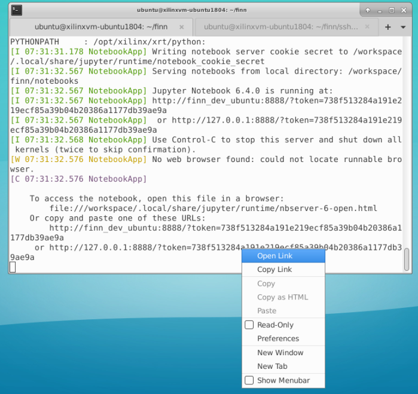
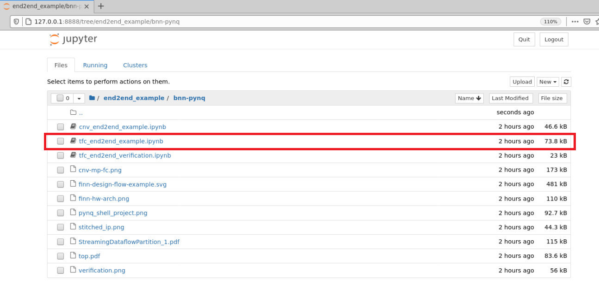
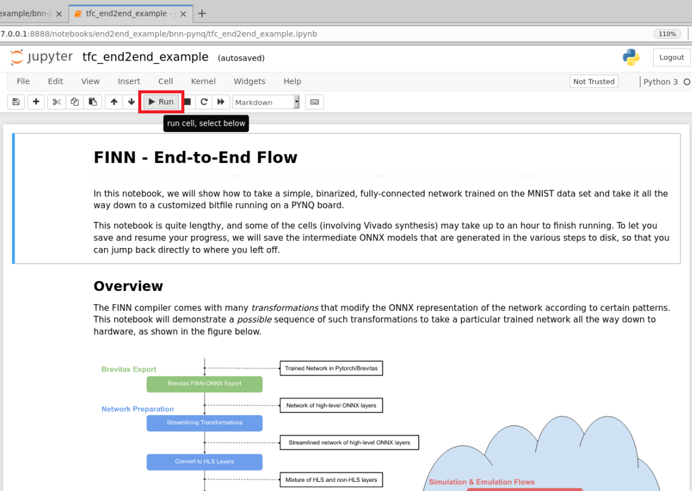
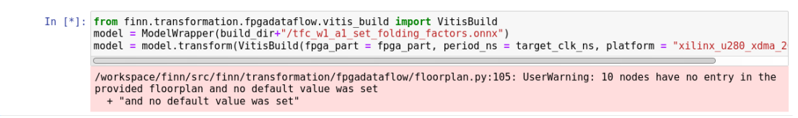

# TFC End-to-End Example Using Alveo U280 

This tutorial provides step-by-step instructions to run [FINN TFC End-to-End example](https://github.com/Xilinx/finn/blob/master/notebooks/end2end_example/bnn-pynq/tfc_end2end_example.ipynb) using MOC and Cloudlab. MOC is used as the development platform. Cloudlab is used as the target platform which hosts Alveo U280 accelerator cards. The FINN example in the Xilinx repository has been originally designed for Pynq devices, and the support for Alveos is fairly recent. Therefore, you will need to make certain changes in some of the files to get this to work on Alevo. This is a lengthy tutorial. You should pay careful attention to every detail, or you may not be able to get this work work on FPGA hardware.   

Please take a look at [this guide](https://github.com/OCT-FPGA/Vitis-Tutorials-U280/blob/master/FINN/issues-and-fixes.md) for issues and fixes. 

## 1. Prerequisites
- An MOC instance should be created by following [this tutorial](https://github.com/OCT-FPGA/oct-tutorials/blob/main/mocsetup/instancesetup.md). You should select the boot image ```vitis20201a-xdma``` when creating the instance.  Note that you will also need a GUI to run through the complete example because there is a jupyter notebook that needs to be run. Instructions on how to get GUI access using VNC and SSH can be found [here](https://github.com/OCT-FPGA/oct-tutorials/blob/main/vncsshsetup/README.md).

- A Cloudlab experiment should be created. This is required for targeting on the U280. Instructions are given [here](https://github.com/OCT-FPGA/oct-tutorials/tree/main/cloudlab-setup). Note that you don't need to set up the experiment until you reached section 4 of the notebook; PYNQ deployment. The Cloudlab experiment is needed only for the targeting workflow. The workflow has been tested on XRT versions 2020.1 and 2020.1.1. Other versions may also work, but not tested. So, you may select a profile such as ```pc151-fpga-xrt-2020.1```, ```pc151-fpga-xrt-2020.1.1```, ```pc153-fpga-xrt-2020.1```, ```pc153-fpga-xrt-2020.1.1``` when creating the experiment.  

## 2. Development platform (MOC)

### 2.1 Tools

- Vitis 2020.1 (already installed on your MOC boot image)
- Jupyter Notebook
- Docker

### 2.2 Install docker

Docker installation instructions for Ubuntu can be found [here](https://docs.docker.com/engine/install/ubuntu/). The following commands need to be run in the order. They are slightly modified from the original to get past the prompts during package installation.

```bash
sudo apt-get remove docker docker-engine docker.io containerd runc
```

```bash
sudo apt-get update
```

```bash
 sudo apt-get install -y \
    apt-transport-https \
    ca-certificates \
    curl \
    gnupg \
    lsb-release
```

```bash
curl -fsSL https://download.docker.com/linux/ubuntu/gpg | sudo gpg --dearmor -o /usr/share/keyrings/docker-archive-keyring.gpg
```

```bash
echo \
  "deb [arch=amd64 signed-by=/usr/share/keyrings/docker-archive-keyring.gpg] https://download.docker.com/linux/ubuntu \
  $(lsb_release -cs) stable" | sudo tee /etc/apt/sources.list.d/docker.list > /dev/null
```

```bash
sudo apt-get update
sudo apt-get install -y docker-ce docker-ce-cli containerd.io
```

Now you need to add yourself to the docker group. This can be done by

```bash
sudo usermod -aG docker ${USER}
```

After doing this you need to log out and log back in so that your group membership is re-evaluated. You can simply close and re-open the PuTTY session window for this to happen.

### 2.3 Clone the repository

```bash
git clone https://github.com/Xilinx/finn
```

Now you need to do several changes in the docker file as well as in the notebook before being able to run the example. You will also need to set up an SSH key. If you don't want to spend time on making these changes, you can download the dockerfile and the notebook in this repository and replace the original files in the Xilinx repository that you have already cloned.

Docker file location:

```bash
finn/docker/Dockerfile.finn_dev
```

Notebook location:

```bash
finn/notebooks/end2end_example/bnn-pynq/tfc_end2end_example.ipynb
```

Skip to Section 2.3.2 if you have done so.

#### 2.3.1 Dockerfile

Add the following lines to the file ```finn/docker/Dockerfile.finn_dev``` after the line ```WORKDIR /workspace```. It may also be fine to add these at the beginning of this file. This will install OpenSSL in your docker image which is required to build the bitstream. 

Note: If you don't include this snippet, VitisBuild will run for several hours without any issues, and will fail at the very last stage of bitstream generation. So, DO NOT FORGET this step.

```bash
#install wget
RUN apt-get update
RUN apt-get install wget
#Install openssl 1.1.1
RUN apt-get update
RUN apt install build-essential checkinstall zlib1g-dev -y
WORKDIR /usr/local/src
RUN wget https://www.openssl.org/source/openssl-1.1.1.tar.gz
RUN tar -xf openssl-1.1.1.tar.gz
WORKDIR /usr/local/src/openssl-1.1.1
RUN bash config --prefix=/usr/local/ssl --openssldir=/usr/local/ssl shared zlib
RUN make
RUN make test
RUN make install
WORKDIR /etc/ld.so.conf.d/
RUN echo "/usr/local/ssl/lib" > openssl-1.1.1.conf
RUN ldconfig -v
WORKDIR /workspace

```

#### 2.3.2 SSH key

Create a directory named named ```ssh_keys``` in ```finn``` base directory.
```bash
finn$ mkdir ssh_keys
```
Generate an SSH key pair 

```bash
ssh-keygen
```

```bash
Generating public/private rsa key pair.
```

If the finn base directory is in your home directory, the ssh key location will be ```/home/ubuntu/finn/ssh_keys/```.

```bash
Enter file in which to save the key (/home/ubuntu/.ssh/id_rsa): /home/ubuntu/finn/ssh_keys/id_rsa
```

You can optionally include a key passphrase for added security, or press enter twice to generate a key pair. You will now see a private key (```id_rsa```) and a public key (```id_rsa.pub```) in this directory. You only need the private key on MOC. The contents of the public key should be copied to the the file```authorized_keys``` in your Cloudlab computer for you to be able to log in to the Cloudlab computer from MOC. If there are existing keys in ```authorized_keys``` (there should be), you can append the public key after the last key in the file. The destination file location is ```<Your Cloudlab IP>:/home/<user name>/.ssh/authorized_keys```. If you haven't set up the Cloudlab server yet, keep in mind that this should be done before you run the application on the FPGA. 

### 2.4 Set up the environment

The following environment variables need to be set before running the example. These can be set either on a terminal or your local .bashrc file.

```bash
XILINX_XRT
VITIS_PATH
VIVADO_PATH
PLATFORM_REPO_PATHS
```

These variables can be set by
```bash
source /opt/xilinx/xrt/setup.sh
export VITIS_PATH="/tools/Xilinx/Vitis/2020.1"
export VIVADO_PATH="/tools/Xilinx/Vivado/2020.1"
export PLATFORM_REPO_PATHS="/opt/xilinx/platforms"
```

### 2.5 Launch the notebook

Enter the following command to run docker and launch the notebook. If this is your first time running, this could take a few minutes to complete because several packages required for the docker image will be downloaded and installed during the image creation process.

```bash
finn$ ./run-docker notebook
```
After the docker image build is completed, right click the URL and open the link as shown in the figure.


Then, go to the directory end2end_example &#8594; bnn-pynq, and click the notebook ```tfc_end2end_example.ipynb```.


After you opened the notebook, make the following changes.

- Replace
```bash
# print the names of the supported PYNQ boards
from finn.util.basic import pynq_part_map
print(pynq_part_map.keys())
```

with
```bash
# print the names of the supported Alveo boards
from finn.util.basic import alveo_part_map
print(alveo_part_map.keys())
```

- Replace
```bash
# change this if you have a different PYNQ board, see list above
pynq_board = "Pynq-Z1"
fpga_part = pynq_part_map[pynq_board]
target_clk_ns = 10

```

with
```bash
# change this if you have a different Alveo board, see list above
alveo_board = "U280"
fpga_part = alveo_part_map[alveo_board]
target_clk_ns = 10
```

- Replace
```bash
from finn.transformation.fpgadataflow.make_zynq_proj import ZynqBuild
model = ModelWrapper(build_dir+"/tfc_w1_a1_set_folding_factors.onnx")
model = model.transform(ZynqBuild(platform = pynq_board, period_ns = target_clk_ns))
```

with
```bash
from finn.transformation.fpgadataflow.vitis_build import VitisBuild
model = ModelWrapper(build_dir+"/tfc_w1_a1_set_folding_factors.onnx")
model = model.transform(VitisBuild(fpga_part = fpga_part, period_ns = target_clk_ns, platform = "xilinx_u280_xdma_201920_3"))

```
- Replace
```bash
! ls {model.get_metadata_prop("vivado_pynq_proj")}
```

with
```bash
! ls {model.get_metadata_prop("vitis_link_proj")}
```

- Replace
```bash
from finn.transformation.fpgadataflow.make_deployment import DeployToPYNQ
ip = "192.168.2.99"
port = "22"
username = "xilinx"
password = "xilinx"
target_dir = "/home/xilinx/finn_tfc_end2end_example"
model = model.transform(DeployToPYNQ(ip, port, username, password, target_dir))
model.save(build_dir + "/tfc_w1_a1_pynq_deploy.onnx")
```

with
```bash
from finn.transformation.fpgadataflow.make_deployment import DeployToPYNQ
ip = "<Your Cloudlab IP>"
port = "22"
username = "Your Cloudlab Username"
password = ""
target_dir = "/users/<Your Cloudlab Username>/finn_tfc_end2end_example"
model = model.transform(DeployToPYNQ(ip, port, username, password, target_dir))
model.save(build_dir + "/tfc_w1_a1_pynq_deploy.onnx")

```

- Replace
```bash
! sshpass -p {password} ssh {username}@{ip} -p {port} 'ls -l {target_dir_pynq}'
```

with
```bash
! ssh {username}@{ip} -p {port} 'ls -l {target_dir_pynq}'
```

- Replace
```bash
! sshpass -p {password} ssh -t {username}@{ip} -p {port} 'echo {password} | sudo -S pip3 install git+https://github.com/fbcotter/dataset_loading.git@0.0.4#egg=dataset_loading'
```

with

```bash
! ssh -t {username}@{ip} -p {port} 'echo {password} | sudo -S pip3 install git+https://github.com/fbcotter/dataset_loading.git@0.0.4#egg=dataset_loading'

```

- Replace
```bash
! sshpass -p {password} ssh -t {username}@{ip} -p {port} 'cd {target_dir_pynq}; echo {password} | sudo -S python3.6 validate.py --dataset mnist --batchsize 1000'
```

with
```bash
! ssh -t {username}@{ip} -p {port} 'cd {target_dir_pynq}; echo {password} | sudo -S python3.6 validate.py --dataset mnist --batchsize 1000'
```

- Replace
```bash
! sshpass -p {password} ssh -t {username}@{ip} -p {port} 'echo {password} | sudo -S pip3 install git+https://github.com/fbcotter/dataset_loading.git@0.0.4#egg=dataset_loading'
```

with
```bash
! ssh -t {username}@{ip} -p {port} 'echo {password} | sudo -S pip3 install git+https://github.com/fbcotter/dataset_loading.git@0.0.4#egg=dataset_loading'
```

- Replace
```bash
! sshpass -p {password} ssh -t {username}@{ip} -p {port} 'cd {target_dir_pynq}; echo {password} | sudo -S python3.6 validate.py --dataset mnist --batchsize 1000'
```

with
```bash
! ssh -t {username}@{ip} -p {port} 'cd {target_dir_pynq}; echo {password} | python3.6 validate.py --dataset mnist --batchsize 1000 --bitfile a.xclbin --platform alveo'
```
After making these changes, save the notebook.

### 2.6 Run the notebook

Click the top cell as shown, and execute cell-by-cell by clicking "Run". 



As you run through these steps, you will also be able to visualize intermediate onnx models by using Nutron. Run the notebook until the ```VitisBuild``` step. 



This step will require several hours (estimated 6-7 hours) to complete. You can have this run overnight and continue running next steps. Make sure you perform the following steps on the target Cloudlab computer before you start FPGA experiments shown in the notebook.

## 3 Target platform (Cloudlab)

### 3.1 Tools

- XRT 2020.1 or 2020.1.1 (already installed on the Cloudlab image) 
- Bitstring
- Pynq
- Conda

Before you start remote execution, make sure that you perform the following steps on the Cloudlab computer.

Append the public key you previously generated (id_rsa.pub) in MOC into ~/.ssh/authorized_keys if you haven't done so already.

<!---### Install bitstring
```bash
pip install bitstring
```
--->

### 3.2 Install bitstring and pynq

Install these packages. Go with the default selection, when prompted.

```bash
sudo apt-get update
sudo apt-get install -y python3-pip
pip3 install bitstring
pip3 install cffi
pip3 install numpy
pip3 install pynq

```

### 3.3 Install anaconda

[This guide](https://pynq.readthedocs.io/en/v2.5.1/getting_started/alveo_getting_started.html) provides instructions on how to install anaconda. Do the following. Go with the defaults, when prompted.

```bash
wget https://repo.anaconda.com/archive/Anaconda3-2019.10-Linux-x86_64.sh
bash Anaconda3-2019.10-Linux-x86_64.sh
```

and then source the conda environment variable by

```bash
source /users/<Your Username>/anaconda3/bin/activate
```

Then create a conda environment with the name ```finn-pynq-alveo```.

```bash
conda create -n finn-pynq-alveo python=3.6
```

<!---After doing these steps source set up ```XILINX_XRT``` environment variable.

```bash
source /opt/xilinx/xrt/setup.sh
```
--->

## 4. All set for FPGA targeting

Once you have made the required changes in the target side, you should be in good shape to continue running the notebook from where you left off, run on the FPGA and get results.

Continue running through the rest of the steps (after VitisBuild) in your notebook.

## Useful links

- [FINN Getting Started Guide](https://finn.readthedocs.io/en/latest/getting_started.html)
