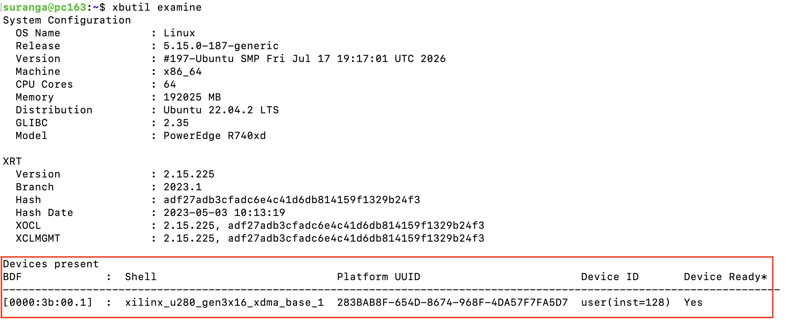

# Vitis Accel Hello World Example on U280

These step-by-step instructions outline how to run a prebuilt "Hello World" (Vector Addition) example on a Xilinx U280 target. The original source files are available in the Xilinx [Vitis Accel Examples](https://github.com/Xilinx/Vitis_Accel_Examples) repository. The prebuilt executable and bitstreams are available [here](https://github.com/OCT-FPGA/Vitis-Tutorials-U280/tree/2023.1/VitisAccelHelloWorld/prebuilt). 

## Prerequisites

### To run the prebuilt example
Allocate an FPGA node on OCT by following [these](https://github.com/OCT-FPGA/OCT-Tutorials/blob/master/cloudlab-setup/fpgas.md) instructions.

### To build from scratch
Access to a build machine with Vitis 2023.1 is required. Please refer to [these](https://github.com/OCT-FPGA/OCT-Tutorials/blob/master/cloudlab-setup/build-machines.md) instructions.

## Tools

- Vitis 2023.1

## 1. Clone the repository

```bash
git clone https://github.com/OCT-FPGA/Vitis-Tutorials-U280
```

## 2. Run the prebuilt example

Make sure that ```XILINX_VITIS``` and ```XILINX_XRT``` environment variables are set. This can be done by running 

```bash
env | grep XILINX
```

This should list Vitis and XRT environment variables.

```
XILINX_VIVADO=/proj/octfpga-PG0/tools/Xilinx/Vivado/2023.1
XILINX_XRT=/opt/xilinx/xrt
XILINX_HLS=/proj/octfpga-PG0/tools/Xilinx/Vitis_HLS/2023.1
XILINX_VITIS=/proj/octfpga-PG0/tools/Xilinx/Vitis/2023.1
```

Then, navigate to the prebuilt directory.

```bash
cd Vitis-Tutorials-U280/VitisAccelHelloWorld/prebuilt
```

### 2.1 Run software and hardware emulation

- SW emulation 

```bash
export XCL_EMULATION_MODE=sw_emu
```

```bash
./hello_world_xrt -x sw_emu/vadd.xclbin
```

- HW emulation 

```bash
export XCL_EMULATION_MODE=hw_emu
```

```bash
./hello_world_xrt -x hw_emu/vadd.xclbin
```

### 2.2 Run on FPGA hardware

Verify that the FPGA device is accessible through XRT before deploying to FPGA hardware; run `xbutil examine` to verify.



```bash
./hello_world_xrt -x hw/vadd.xclbin
```
You should see "TEST PASSED" printed on the terminal.

Note: If an error pops up, try unsetting the XCL_EMULATION_MODE variable.

```bash
unset XCL_EMULATION_MODE
```

## 3 Build from scratch 

Log into the build machine, clone the Vitis Accel Examples repository.

```git clone https://github.com/Xilinx/Vitis_Accel_Examples -b 2023.1```
```cd Vitis_Accel_Examples/hello_world```

### 3.1 SW emulation

```bash
make all TARGET=sw_emu PLATFORM=/opt/xilinx/platforms/xilinx_u280_gen3x16_xdma_1_202211_1/xilinx_u280_gen3x16_xdma_1_202211_1.xpfm
```

### 3.2 HW emulation

```bash
make all TARGET=hw_emu PLATFORM=/opt/xilinx/platforms/xilinx_u280_gen3x16_xdma_1_202211_1/xilinx_u280_gen3x16_xdma_1_202211_1.xpfm
```

### 3.3 HW build

```bash
make all TARGET=hw PLATFORM=/opt/xilinx/platforms/xilinx_u280_gen3x16_xdma_1_202211_1/xilinx_u280_gen3x16_xdma_1_202211_1.xpfm
```
